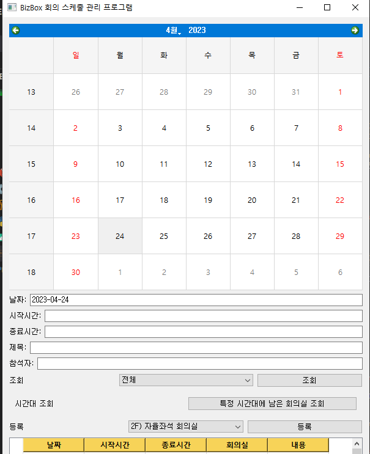

# BizBoxMeetingManager-
BizBox 웹 페이지를 기반으로 회의실 등록 및 조회하는 프로그램 만들어보기

# 주의사항
- 개인 노트북에서 사용하실 것을 권장함.
# 화면




# 사용법

## 0. 패키지 설치

- 패키지 버전이 중요하므로, 설치해야 함. 

```
pip install -r requirements.txt
```

## 1. 아이디와 패스워드 입력

info.ini 파일을 만들고 다음과 같이 아이디와 패스워드를 입력합니다.

```
[USER]
id=abcde
pw=12345
```

## 2. 회의실 조회

캘린더에 특정 날짜를 선택하고, 조회 버튼을 누르면 해당 날짜의 회의실 예약 현황을 조회할 수 있습니다.
조회 버튼 옆에 있는 회의실명을 선택하면, 특정 회의실의 예약 현황을 조회할 수 있습니다.

## 2.1 추가 기능(시간대 조회 기능)

- 날짜, 시작 시간, 종료 시간을 입력하고 버튼(특정 시간대에 남은 회의실 조회)를 클릭하면, 해당 시간대의 회의실 예약 현황과 남은 회의실을 메시지로 알려줄 수 있습니다.

## 3. 회의실 등록
시작 시간과 종료 시간과 회의실명을 입력하고, 등록 버튼을 누르면 회의실을 등록할 수 있습니다.
추가로 다른 참석자들을 추가할 수 있습니다.

아래 처럼 `,` 로 구분지어주면 됩니다.

```
홍길동, 김철수, 이영희, 박영수
```


# TODO

- [x] 예약자 추가할 수 있는 기능
- [x] ZOOM 조회 기능
- [x] ZOOM 예약 기능
- [ ] ZOOM 예약 취소 기능
- [ ] 회의실 예약 취소 기능
- [ ] 회의실 예약 수정 기능
- [ ] 에러 처리 기능 (참석자 실제 존재 여부, 중복 예약 등)
- [ ] 회의실 특정 시간대별 예약 현황 조회 기능
